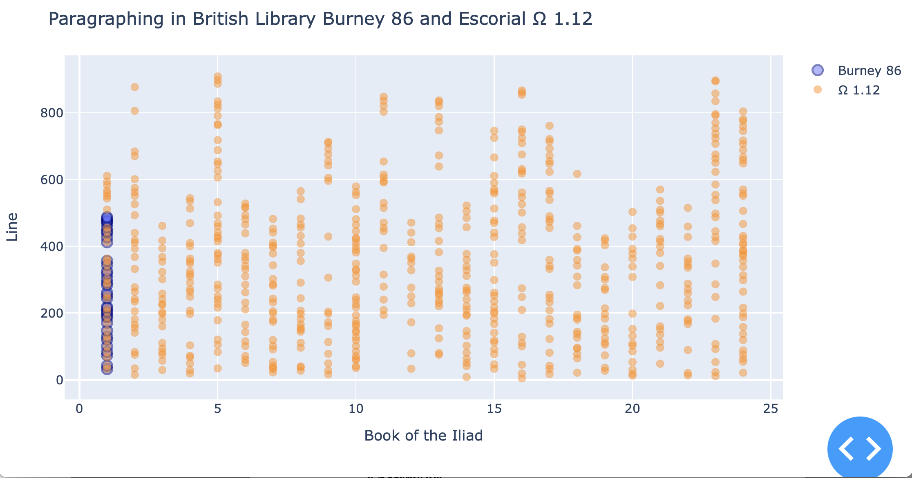

# Manuscript: British Library, Burney 86

Information on the organization and structure of the manuscript British Library, Burney 86 (the "Townley Homer").

## Quick reference

URNs used in tables here:

- *Iliad* text of Burney 86:  `urn:cts:greekLit:tlg0012.tlg001.burney86:`
- pages of the manuscript: `urn:cite2:citebl:burney86pages.v1:`
- images of the manuscript: `urn:cite2:citebl:burney86imgs.v1:`

## Links

- HMT [codex browser](https://www.homermultitext.org/codex-browser/)

Here's the app this project will feed into:

- HMT [index of *Iliad* lines to MSS](https://www.homermultitext.org/iliad-browser/)

Background information on the manuscript:

- [description (with bibliography)](https://www.bl.uk/manuscripts/FullDisplay.aspx?ref=burney_ms_86) from the British Library

## Paleographic guide

See the [project wiki](https://github.com/hmteditors/burney86-structure/wiki/Paleographic-guide).

## Using `git` in the St. Isidore lab

We can't save user names and emais on our lab machines, so before you try to commit and push, be sure to configure git for your session:

1. In VS Code, choose `New Terminal` from the `Terminal` menu
2. Enter these two commands:

- `git config user.name "YOUR REAL-WORLD NAME"`
- `git config user.email "YOUR EMAIL"`

## Visualizing progress so far

The `dashboard` directory includes an interactive dashboard where you can see our progress so far.  One easy way to run the dashboard:

- in VS Code, open the file `progress.jl`
- with your mouse anywhere in the open file, hold the option key down and `enter` or `return`. (If you don't like the keyboard you're using, you can also use the VS Code command palette to run `Julia: Execute Code in REPL`)

It will looking something like this.

